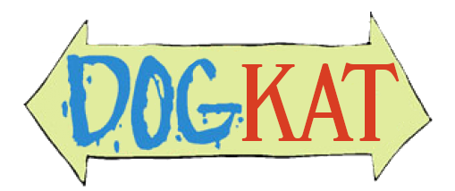

# DogKat

<div align="center">

</div>

DogKat is an End-2-End tester that will test a variety of elements of a Kubernetes cluster.

*The resources are baked into the binary (instead of using an external Helm Chart as previous versions did).*

The tests are separated out into logical workloads so that core workloads can be tested with additional tests able to be
run on top.

| Run              | Description                                                                                                                                                                                                                                                                                                                                                                                         |
|------------------|-----------------------------------------------------------------------------------------------------------------------------------------------------------------------------------------------------------------------------------------------------------------------------------------------------------------------------------------------------------------------------------------------------|
| Core             | Deploys an Nginx deployment and SQL StatefulSet. Nginx Pod is a collection of Nginx, PHP and Nginx Prometheus Exporter. It has ConfigMap mounts and SQL password mounts and has Affinity with SQL and anti-affinity with itself. SQL contains Postgres with CM and Secret Mounting along with PersistentVolumeClaims for testing the CSI. It has affinity with Nginx and anti-affinity with itself. |
| Ingress          | Contains the Core workload and also deploys an Ingress resource. The Ingress can be configured to support TLS too allowing testing of things like Cert-Manager.                                                                                                                                                                                                                                     |
| GPU              | Deploys an Nvidia sample application for adding Vectors. This test will be targeted at a GPU node and will confirm the function of a GPU in a cluster.                                                                                                                                                                                                                                              |
| **Coming Soon ** |                                                                                                                                                                                                                                                                                                                                                                                                     |
| Monitoring       | Will deploy the core workload and also deploy a ServiceMonitor and a Grafana Dashboard for the Nginx service to display Grafana Functionality. The Service Monitor will need to be manually checked until a decision on vaildation that this is working can be achieved.                                                                                                                            |
| Istio            | This will deploy the core workload and then add a Virtual Service and Gateway on. It will then be validated in the same was as the Ingress test. This will confirm basic functionality of Istio.                                                                                                                                                                                                    |

## Metrics

Metrics are collected to log the time it takes for each test to run. As this is a short-lived application, the usual
process of serving up metrics at `/metrics` cannot be achieved. As such, DogKat requires a prometheus push-gateway to be
configured so that it can send metrics there instead of having them scraped.

If a push gateway isn't detected then metrics are still collected, but you won't be able to access them. An error will
be reported to notify you that the push didn't succeed, and it'll just move on.

## TODO

* Detect availability of things like an Ingress Controller and StorageClass before running tests.
* Implement Go Testing.
* Monitoring detection and testing.
* Istio detection and testing.

See below for a comprehensive list of tests and what can be confirmed using this tool.

## Usage

For details on how to use the tool, run `dogkat --help`

### Examples

#### Test core workloads with a defined storage class:

```shell
dogkat validate core --storage-class longhorn
```

#### Test Ingress with tls:

```shell
dogkat validate ingress --storage-class longhorn --ingress-class nginx --enable-tls --annotations cert-manager.io/cluster-issuer=letsencrypt
```

#### Test GPU

```shell
dogkat validate gpu --number-of-gpus 1
```

#### Cleanup

```shell
dogkat delete
```

## Using The Chart

```shell
helm install oci:///charts/dogkat --values values.yaml
```

## Updating the Chart

Make sure you've run and resolved any issues using the following as failures of these will cause the pipeline/actions to
fail.

```
helm-docs
ct lint --all --validate-maintainers=false --config .github/ct.yaml
golangci-lint run --out-format=github-actions --timeout=3m
```

## Development

To test any changes the app should be run against a cluster using a pre-built chart.

```shell
helm package --app-version 0.0.0 --version 0.0.0 charts/dogkat -d /tmp/
```

Then copy the `dogkat-example.yaml` into `/tmp/` and make any required edits. Once done, you can deploy the pre-packaged
chart.

```shell
go run cmd/dogkat/main.go validate -n dogkat
```
